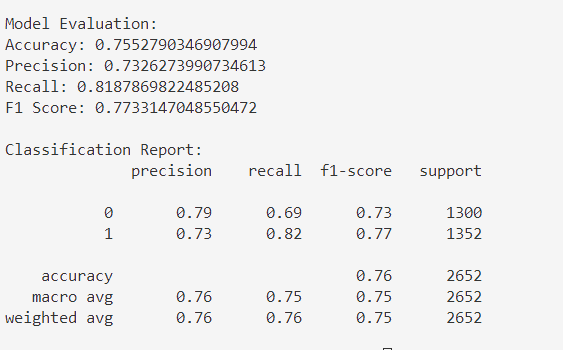
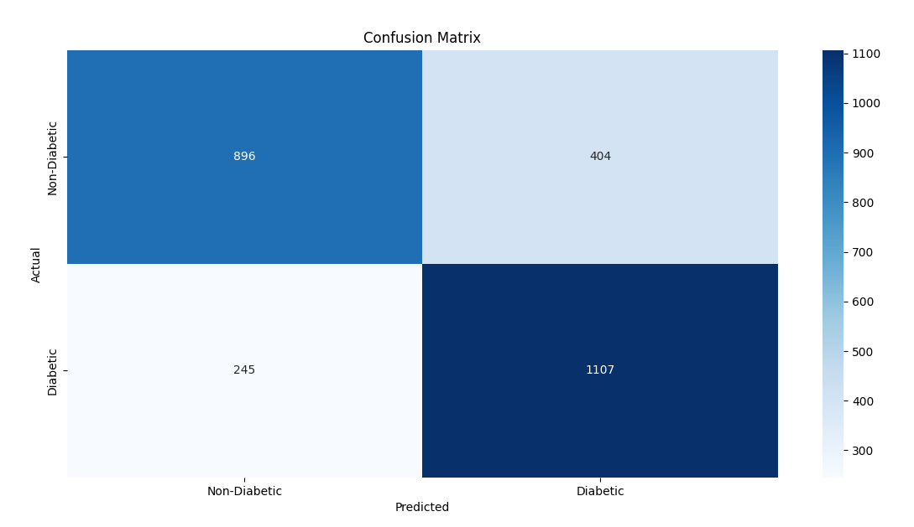

# Implementation of Logistic Regression Model for Classifying Food Choices for Diabetic Patients

## AIM:
To implement a logistic regression model to classify food items for diabetic patients based on nutrition information.

## Equipments Required:
1. Hardware – PCs
2. Anaconda – Python 3.7 Installation / Jupyter notebook

## Algorithm
1. Load Dataset
2. Data Preprocessing
3. Split Data into Training and Testing Sets
4. Train Logistic Regression Model
5. Make Predictions
6. Evaluate Model Performance
7. Visualize Results
8. Predict for New Data
## Program:
```
/*
Program to implement Logistic Regression for classifying food choices based on nutritional information.
Developed by: Vishwaraj G
RegisterNumber:  212223220125
*/
import pandas as pd
from sklearn.model_selection import train_test_split
from sklearn.linear_model import LogisticRegression
from sklearn.metrics import accuracy_score, precision_score, recall_score, f1_score, confusion_matrix, classification_report
import seaborn as sns
import matplotlib.pyplot as plt

# Load the dataset
url = "https://cf-courses-data.s3.us.cloud-object-storage.appdomain.cloud/IBM-ML241EN-SkillsNetwork/labs/datasets/food_items.csv"
df = pd.read_csv(url)

# Inspect the dataset
print("Dataset Overview:")
print(df.head())
print("\nDataset Info:")
print(df.info())

# Encode the target column ('class') into binary labels
# Assuming 'Diabetic' means classifying 'In Moderation' as 1 (diabetic-friendly) and others as 0
df['class'] = df['class'].str.strip("'")  # Remove surrounding quotes
df['Diabetic'] = df['class'].apply(lambda x: 1 if x == 'In Moderation' else 0)

# Define features and target
X = df.drop(columns=['class', 'Diabetic'])  # Features
y = df['Diabetic']  # Target variable

# Split the dataset into training and testing sets
X_train, X_test, y_train, y_test = train_test_split(X, y, test_size=0.2, random_state=42)

# Train the Logistic Regression model
log_reg = LogisticRegression(max_iter=1000, random_state=42)
log_reg.fit(X_train, y_train)

# Make predictions
y_pred = log_reg.predict(X_test)

# Evaluate the model
print("\nModel Evaluation:")
print("Accuracy:", accuracy_score(y_test, y_pred))
print("Precision:", precision_score(y_test, y_pred))
print("Recall:", recall_score(y_test, y_pred))
print("F1 Score:", f1_score(y_test, y_pred))
print("\nClassification Report:")
print(classification_report(y_test, y_pred))

# Confusion Matrix
conf_matrix = confusion_matrix(y_test, y_pred)
plt.figure(figsize=(8, 6))
sns.heatmap(conf_matrix, annot=True, fmt='d', cmap='Blues', xticklabels=['Non-Diabetic', 'Diabetic'], yticklabels=['Non-Diabetic', 'Diabetic'])
plt.title('Confusion Matrix')
plt.xlabel('Predicted')
plt.ylabel('Actual')
plt.show()
```

## Output:

 
## Result:
Thus, the logistic regression model was successfully implemented to classify food items for diabetic patients based on nutritional information, and the model's performance was evaluated using various performance metrics such as accuracy, precision, and recall.
