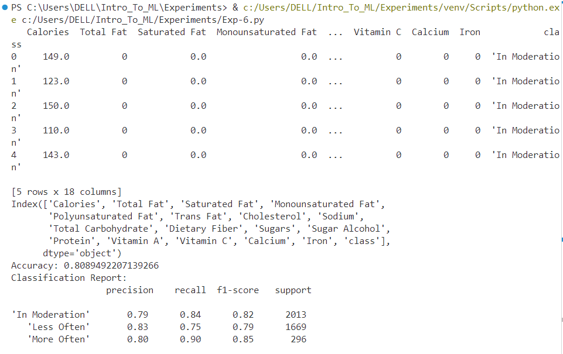
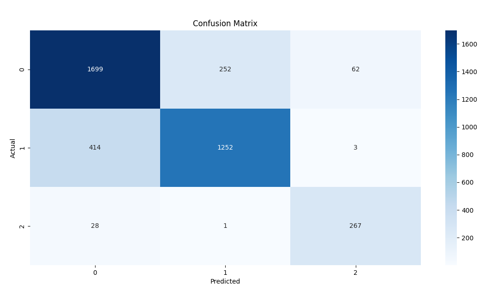

# Implementation of Logistic Regression Model for Classifying Food Choices for Diabetic Patients

## AIM:
To implement a logistic regression model to classify food items for diabetic patients based on nutrition information.

## Equipments Required:
1. Hardware – PCs
2. Anaconda – Python 3.7 Installation / Jupyter notebook

## Algorithm
1. Load Dataset
2. Data Preprocessing
3. Split Data into Training and Testing Sets
4. Train Logistic Regression Model
5. Make Predictions
6. Evaluate Model Performance
7. Visualize Results
8. Predict for New Data
## Program:
```
/*
Program to implement Logistic Regression for classifying food choices based on nutritional information.
Developed by: Vishwaraj G
RegisterNumber:  212223220125
*/
# Importing necessary libraries
import pandas as pd
import numpy as np
from sklearn.model_selection import train_test_split
from sklearn.linear_model import LogisticRegression
from sklearn.metrics import accuracy_score, confusion_matrix, classification_report, roc_curve
from sklearn.preprocessing import StandardScaler
import matplotlib.pyplot as plt
import seaborn as sns

# Load the Pima Indians Diabetes Dataset from GitHub
data_url = 'https://raw.githubusercontent.com/jbrownlee/Datasets/master/pima-indians-diabetes.data.csv'
column_names = ['Pregnancies', 'Glucose', 'BloodPressure', 'SkinThickness', 'Insulin', 
                'BMI', 'DiabetesPedigreeFunction', 'Age', 'Outcome']
data = pd.read_csv(data_url, names=column_names)

# Display the first few rows of the dataset
print("Dataset Head:")
print(data.head())

# Data Preprocessing
# Selecting feature columns (X) and target column (y)
X = data[['Glucose', 'BloodPressure', 'BMI', 'Age']]  # You can add or remove features based on your analysis
y = data['Outcome']  # Target column (0 for non-diabetic, 1 for diabetic)

# Handling Missing Values (if any) by replacing with mean
X = X.fillna(X.mean())

# Feature Scaling
scaler = StandardScaler()
X = scaler.fit_transform(X)

# Split the data into training and testing sets
X_train, X_test, y_train, y_test = train_test_split(X, y, test_size=0.2, random_state=42)

# Initialize and Train the Logistic Regression model
model = LogisticRegression(max_iter=1000)  # Increased max_iter for convergence
model.fit(X_train, y_train)

# Model Prediction
y_pred = model.predict(X_test)

# Model Evaluation
accuracy = accuracy_score(y_test, y_pred)
conf_matrix = confusion_matrix(y_test, y_pred)
class_report = classification_report(y_test, y_pred)

print("Model Accuracy:", accuracy)
print("Confusion Matrix:\n", conf_matrix)
print("Classification Report:\n", class_report)


# Confusion Matrix Plot
plt.figure(figsize=(5, 4))
sns.heatmap(conf_matrix, annot=True, fmt='d', cmap='coolwarm', cbar=False, 
            xticklabels=['Non-Diabetic', 'Diabetic'], yticklabels=['Non-Diabetic', 'Diabetic'])
plt.title("Confusion Matrix")
plt.xlabel("Predicted")
plt.ylabel("Actual")
plt.show()

# Example prediction (Assuming a new patient with example health values)
new_patient = np.array([[130, 70, 28.5, 45]])  # Replace with actual values for Glucose, BloodPressure, BMI, Age
new_patient_scaled = scaler.transform(new_patient)
pred_diabetes = model.predict(new_patient_scaled)

print("Predicted Outcome for New Patient:", "Diabetic" if pred_diabetes[0] == 1 else "Non-Diabetic")

```

## Output:


## Result:
Thus, the logistic regression model was successfully implemented to classify food items for diabetic patients based on nutritional information, and the model's performance was evaluated using various performance metrics such as accuracy, precision, and recall.
